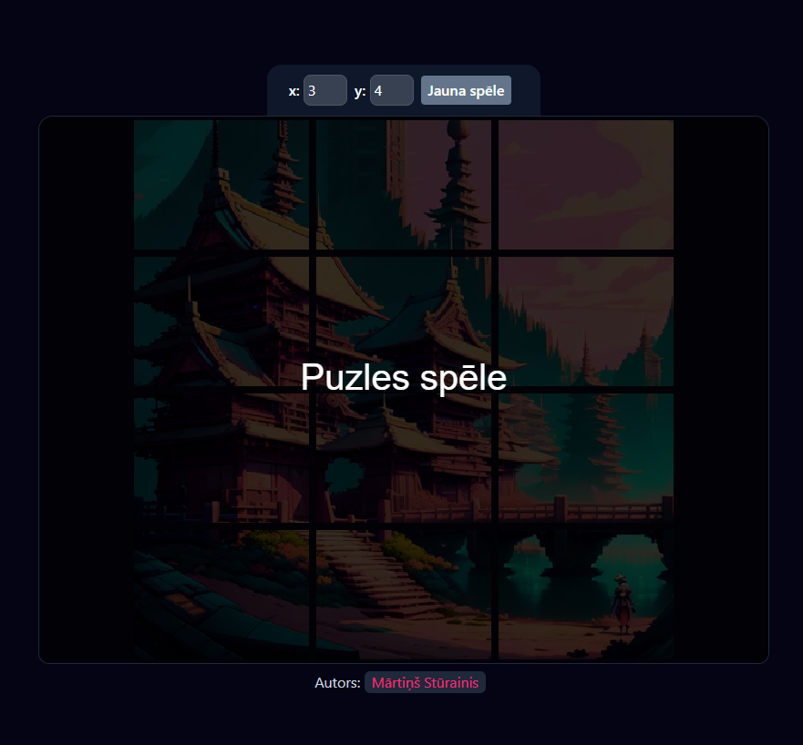

# Puzles spēle (javaScript canvas)

## Uzstādīšana

1. Lejupielādēt un instalēt node.js: https://nodejs.org/en/download 
2. Instalēt `yarn` pakotņu pārvaldnieku ar komandu `npm i -g yarn`
3. Instalēt bibliotēkas (live-server un tailwindcss) ar komandu no konkrētās direktorijas, kuras atrodas `package.json` fails:
4. Palaist failu dev.bat (ja izmantojiet Windows operētājsistēmu) `npm install`

